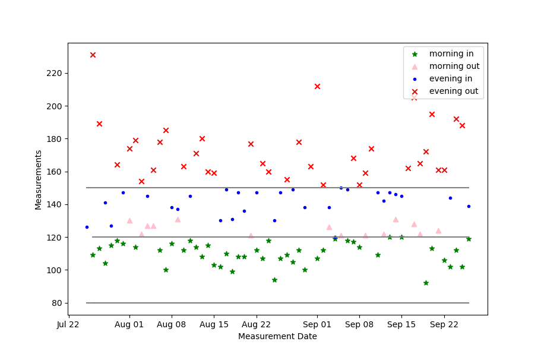

# mesurements
Program to take and plot daily measurements

This program, measure_plotting.py, reads a set of simple text data files data/*.data and creates a plot.
## Example Plot
 is an example results plot.
## Data Files
### Data File Format
```
  # comments
  yyyy # year
  DD MMM morning_value evening_value   # day of month, month e.g. feb
  ...
```

### Data file Example (partial)
```
  Sugar 2021 Jan
  Sugar5
  2021
  01 Jan 132 128
  02 Jan 137 162
  03 Jan 115 156
```
